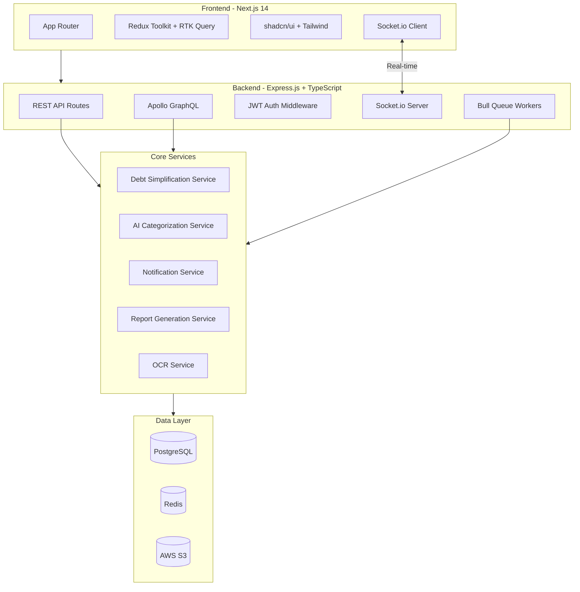
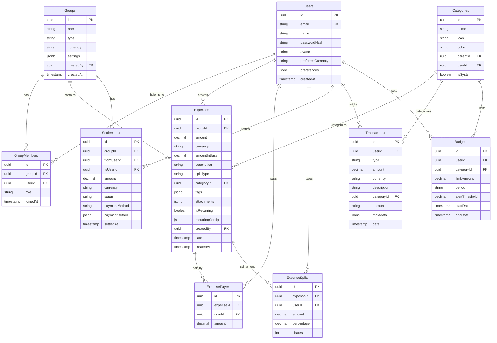

# Production-Grade Expense Splitting & Money Management App

## High-Level Architecture




## Project Structure

```
splitwise/
├── docker-compose.yml
├── .env.example
├── packages/
│   ├── shared/                  # Shared types, validation schemas, utils
│   │   ├── src/
│   │   │   ├── types/
│   │   │   ├── schemas/         # Zod schemas shared FE+BE
│   │   │   └── utils/
│   │   ├── package.json
│   │   └── tsconfig.json
│   │
│   ├── backend/
│   │   ├── src/
│   │   │   ├── config/          # env, db, redis, s3 config
│   │   │   ├── middleware/      # auth, rateLimit, errorHandler, validation
│   │   │   ├── modules/
│   │   │   │   ├── auth/        # controller, service, routes, types
│   │   │   │   ├── users/
│   │   │   │   ├── groups/
│   │   │   │   ├── expenses/
│   │   │   │   ├── settlements/
│   │   │   │   ├── transactions/
│   │   │   │   ├── budgets/
│   │   │   │   └── ai/
│   │   │   ├── shared/
│   │   │   │   ├── database/    # Prisma client, migrations
│   │   │   │   ├── cache/       # Redis wrapper
│   │   │   │   ├── queue/       # Bull queue setup
│   │   │   │   ├── socket/      # Socket.io server
│   │   │   │   └── services/    # S3, email, etc.
│   │   │   ├── graphql/         # Apollo Server schemas + resolvers
│   │   │   └── app.ts           # Express app setup
│   │   ├── prisma/
│   │   │   └── schema.prisma
│   │   ├── Dockerfile
│   │   ├── package.json
│   │   └── tsconfig.json
│   │
│   └── frontend/
│       ├── src/
│       │   ├── app/             # Next.js App Router pages
│       │   │   ├── (auth)/      # login, register
│       │   │   ├── dashboard/
│       │   │   ├── groups/
│       │   │   ├── budgets/
│       │   │   ├── reports/
│       │   │   ├── settings/
│       │   │   └── layout.tsx
│       │   ├── components/
│       │   │   ├── ui/          # shadcn components
│       │   │   ├── layout/      # Sidebar, Header, etc.
│       │   │   ├── groups/
│       │   │   ├── expenses/
│       │   │   ├── budgets/
│       │   │   └── charts/
│       │   ├── store/           # Redux slices + RTK Query
│       │   ├── hooks/
│       │   ├── lib/             # utils, socket client, api helpers
│       │   └── styles/
│       ├── Dockerfile
│       ├── package.json
│       └── tsconfig.json
│
├── package.json                 # Root workspace (npm workspaces)
└── tsconfig.base.json
```

## Database Schema (PostgreSQL + Prisma)




## Implementation Plan by Todo

### Phase 1 - Foundation and Infrastructure

**1. Monorepo setup**: npm workspaces with root `package.json`, `tsconfig.base.json`, and three packages (`shared`, `backend`, `frontend`). Docker Compose with PostgreSQL 16 and Redis 7 services.

**2. Shared package**: Zod validation schemas for all entities (users, groups, expenses, settlements, transactions, budgets). Shared TypeScript types/interfaces. Utility functions (currency formatting, date helpers).

**3. Backend foundation**: Express.js app with TypeScript strict mode. Middleware stack: CORS, helmet, compression, rate limiting (express-rate-limit + Redis store), request logging (morgan/pino), global error handler. Prisma ORM setup with the full schema above (all tables from day one). JWT auth with access + refresh tokens, bcrypt password hashing, Google OAuth via Passport.js.

**4. Auth module**: Register, login, refresh, logout endpoints. Refresh token rotation stored in Redis. Password reset flow.

**5. Users module**: Profile CRUD, avatar upload (S3), preferences management.

**6. Groups module**: CRUD, member management (add/remove/role), invitation system.

**7. Frontend foundation**: Next.js 14 App Router, Tailwind CSS, shadcn/ui init. Redux Toolkit store with slices (auth, groups, expenses, budgets, ui). RTK Query API definitions with tag-based cache invalidation. Protected route layout with sidebar navigation. Auth pages (login, register) with React Hook Form + Zod.

### Phase 2 - Core Expense Splitting

**8. Expenses module (backend)**: Full CRUD with all split types (equal, percentage, exact, shares). Multiple payers support. ExpensePayers and ExpenseSplits models. Pagination, filtering, search on expenses.

**9. Debt simplification service**: Graph-based min-cash-flow algorithm. Given all expenses in a group, compute net balances, then minimize number of transactions needed. Cache results in Redis (5 min TTL), invalidate on expense changes.

**10. Settlements module**: Record settlements between users. Update balances. Settlement history with status tracking.

**11. Expense UI**: Group detail page with expense list, add/edit expense modal with split type selector, balance summary cards, settle up flow.

### Phase 3 - Personal Finance

**12. Transactions module**: Income/expense tracking across multiple accounts. Category assignment, search/filter.

**13. Budgets module**: Category-wise budget limits with period (weekly/monthly/yearly). Alert thresholds. Spending progress calculation.

**14. Dashboard and analytics UI**: Personal finance overview with summary cards. Recharts for cash flow trends (daily/weekly/monthly). Budget progress bars. Category breakdown pie chart. Net worth tracker.

### Phase 4 - Advanced Features

**15. Real-time with Socket.io**: Server rooms per group. Events: expense_added, expense_updated, settlement_created, member_joined. Client-side optimistic updates.

**16. AI integration**: Claude API wrapper service via `@anthropic-ai/sdk`. Auto-categorize expenses from descriptions. Natural language expense entry parsing. Monthly financial insights generation. LangChain.js for structured output.

**17. File uploads and OCR**: Multer + AWS S3 for receipt uploads. OCR via Tesseract.js (local) or AWS Textract. Parse extracted text into expense fields.

**18. Multi-currency support**: Exchange rate API integration (exchangerate-api). Store amounts in base currency + original. Currency conversion display in UI.

**19. Reports and exports**: CSV export of expenses/transactions. PDF report generation (PDFKit). Email notifications via Nodemailer + Bull queue.

**20. GraphQL API**: Apollo Server alongside REST. Schemas for groups, expenses, balances. Useful for flexible frontend queries (dashboard aggregations).

**21. Docker and deployment**: Backend + Frontend Dockerfiles. Docker Compose for full local development (app + DB + Redis). GitHub Actions CI pipeline stub. .env.example with all variables.

## Key Technical Decisions

- **Prisma over raw SQL**: Type-safe queries, auto-generated migrations, excellent TS integration. Use raw SQL only for the debt simplification algorithm if needed for performance.
- **PostgreSQL JSONB**: For flexible fields (preferences, tags, attachments, recurringConfig) instead of adding MongoDB. Keeps the data layer simpler.
- **npm workspaces**: Lightweight monorepo without Turborepo/Nx overhead. Shared types compiled once, consumed by both FE and BE.
- **RTK Query**: Handles API caching, request deduplication, and cache invalidation cleanly. Pairs well with Redux for local state.
- **Bull Queue + Redis**: Background jobs for debt recalculation, notifications, reports. Redis already present for caching/sessions.

## Build Order (sequential dependencies)

1. Docker Compose + monorepo scaffold
2. Shared package (types + schemas)
3. Backend: config, middleware, Prisma schema + migrations
4. Backend: auth module
5. Frontend: scaffold + auth pages
6. Backend: groups + members
7. Frontend: groups UI
8. Backend: expenses + splits + debt simplification
9. Frontend: expense UI + balances
10. Backend: settlements
11. Frontend: settle up flow
12. Backend: transactions + budgets
13. Frontend: dashboard + charts + budgets
14. Backend: Socket.io real-time
15. Frontend: real-time integration
16. Backend: AI categorization + OCR
17. Frontend: AI features integration
18. Backend: multi-currency, reports, GraphQL
19. Frontend: currency selector, exports, reports
20. Docker production builds + CI pipeline

